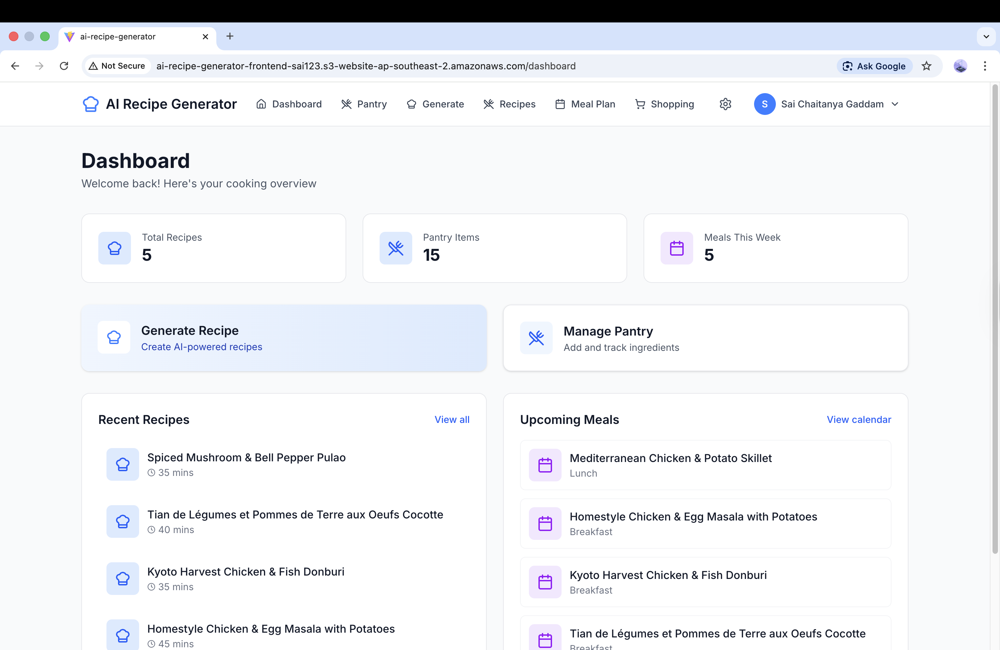

# 🍳 AI Recipe Generator – Frontend

<p align="center">
  
  
  
  
</p>

<p align="center">
  🌐 Modern React frontend for AI-powered recipe generation with cloud deployment
</p>

---

## 🌟 Overview

The **AI Recipe Generator Frontend** provides a seamless interface for interacting with backend services to:

- Generate recipes using AI
- Manage pantry items
- Plan meals and shopping lists

It integrates with a REST API hosted on AWS EC2, delivering a fast, scalable, and user-friendly experience.

---

## 🏗 Architecture

```text
Browser → React (Vite, S3 Static Hosting) → REST API (Node.js, EC2 Docker) → Neon PostgreSQL
```

---

## 🚀 Features

- 🔐 **User Authentication (JWT-Based)**
  Secure login & signup using JSON Web Tokens (JWT) for stateless authentication.
  Tokens are stored on the client and included in API requests via Axios.

- 🤖 **AI Recipe Generation UI (Backend AI Service)**
  Clean and interactive interface to generate recipes powered by backend AI APIs.

- 🥫 **Pantry Management Interface (REST API + Neon PostgreSQL)**
  Add, update, and track pantry items with real-time data synced through backend services.

- 📅 **Meal Planning Dashboard (State Management + API Integration)**
  Organise meals with a dynamic UI that reflects live backend data.

- 🛒 **Shopping List UI (Derived Data + API Sync)**
  Automatically generate shopping lists based on pantry items and planned meals.

- 🌐 **Cloud Hosting (AWS S3 Static Website Hosting)**
  Frontend is deployed and served via AWS S3 for high availability.

- ⚡ **API Communication (Axios + REST API)**
  Efficient and scalable communication with backend services hosted on AWS EC2 (Dockerised Node.js API).

- 📦 **Fast Build & Performance (Vite)**
  Optimised build system ensuring fast development and high-performance production builds.

---

## 🛠 Tech Stack

- 🎨 **Frontend:** React (Vite)
- 🔗 **API Communication:** Axios (REST API Integration)
- ☁️ **Hosting:** AWS S3 (Static Website Hosting)
- ⚙️ **Backend:** Node.js (Express API on EC2, Dockerised)
- 🗄️ **Database:** Neon PostgreSQL

---

## 📸 Screenshots

_Add real screenshots here (this boosts recruiter interest significantly)_

```markdown


```

---

## 🌐 Live Website

👉 http://ai-recipe-generator-frontend-sai123.s3-website-ap-southeast-2.amazonaws.com

---

## ⚙️ Environment Variables

Create a `.env` file:

```env
VITE_API_URL=http://<EC2-IP>:8000/api
```

---

## 💻 Run Locally

```bash
npm install
npm run dev
```

---

## 📦 Build for Production

```bash
npm run build
```

---

## ☁️ Deployment

- 🚀 Hosted on AWS S3
- 🌍 Served via static website hosting
- 🔗 Connected to backend API on EC2
- 📦 Backend containerised using Docker

---

## 🔗 Backend API

```text
http://<EC2-IP>:8000/api
```

---

## 🔮 Future Improvements

- 🌍 Add AWS CloudFront (CDN) for global performance optimisation
- 🔒 Enable HTTPS (SSL) for secure communication
- 🔁 Implement CI/CD pipeline (GitHub Actions)
- 📱 Improve mobile responsiveness and UX
- 🧠 Enhance AI capabilities with advanced prompts

---

## 👨‍💻 Author

**Sai Chaitanya**

- 🌐 Sydney, Australia
- 💼 Open to opportunities
- 🔗 LinkedIn: https://www.linkedin.com/in/sai-chaitanya-73b598284/
- 💻 GitHub: https://github.com/sai02-creator

---

## ⭐ Support

If you found this project useful, consider giving it a ⭐ on GitHub!
